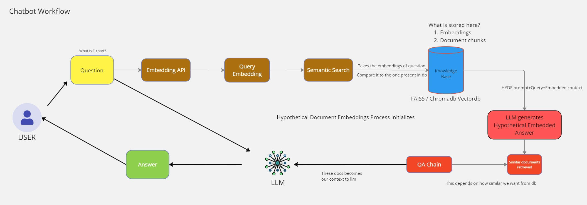

## Langchain_Rag_LLM Documentation

🏥 A powerful and intuitive healthcare information system powered by advanced language models and vector databases.

## Table of Contents
1. [Project Overview](#project-overview)
2. [Features](#features)
3. [Architecture](#architecture)
4. [System Diagram](#system-diagram)
5. [Technologies Used](#technologies-used)
6. [Setup and Installation](#setup-and-installation)
7. [Usage](#usage)
8. [Deployment](#deployment)
9. [Contributing](#contributing)
10. [License](#license)

## Project Overview

Chatbot RAG Compilation is a sophisticated information system that leverages cutting-edge AI technologies to provide intelligent document management, question answering, and information retrieval capabilities. The system uses a combination of large language models (LLMs) and vector databases to process and analyze documents, offering a user-friendly interface for professionals to interact with the system.

## Features

1. 🤖 AI-powered question answering system
2. 📚 Intelligent document retrieval and management
3. 🔍 Advanced search capabilities using vector embeddings
4. 🔄 Real-time vector database updates
5. 🖥️ User-friendly Gradio interface
6. 🚀 Scalable architecture using Docker and Docker Compose
7. 🧠 Support for multiple LLM providers (Ollama and NVIDIA)

## Architecture

The Chatbot RAG Compilation system consists of several interconnected components:

1. **FastAPI Backend (`app_server.py`)**: Handles API requests, manages the vector database, and orchestrates the LLM interactions.
2. **Gradio UI (`gradio_ui.py`)**: Provides a user-friendly web interface for interacting with the system.
3. **Vector Database Update Script (`update_vector_db.sh`)**: Keeps the vector database up-to-date with the latest document changes.
4. **Vector Embedding Script (`vector_embed.py`)**: Processes documents and creates vector embeddings for efficient search and retrieval.
5. **Docker Compose Configuration (`docker-compose.yaml`)**: Defines the multi-container Docker application for easy deployment and scaling.

## RAG System Diagram


### Chatbot Workflow - Embedding Process data Files

This diagram represents the process of converting Markdown (`.md`) files into vector embeddings, which are used for efficient document retrieval in the system.

#### 1. **Document Loading**
   - **Description**: The process starts with loading Markdown (`.md`) files from a specified directory using a `DirectoryLoader`. This loader scans the directory and reads all relevant Markdown files.
   - **Purpose**: To collect all the documents that need to be processed into embeddings, ensuring that the system has access to the latest content from the provided directory.

#### 2. **Content Splitting**
   - **Description**: Once the Markdown files are loaded, the content within each file is split into smaller chunks. Two main techniques are used here:
     - **Markdown Header Splitting**: The content is initially split based on the headers (e.g., `#`, `##`, `###`), allowing logical divisions of the document based on its structure.
     - **Recursive Character Splitting**: After header-based splitting, the content is further divided into smaller chunks using a recursive character text splitter, ensuring that each chunk fits within a defined size (e.g., 500 characters) with some overlap between chunks.
   - **Purpose**: To break down large documents into manageable pieces that can be efficiently processed, indexed, and searched.

#### 3. **Embedding Generation**
   - **Description**: Each chunk of text generated from the previous step is passed through an embedding model, specifically the Ollama embedding model. This model converts the textual content into vector embeddings, which are numerical representations of the text's semantic meaning.
   - **Purpose**: These embeddings allow the system to perform similarity searches by comparing the numerical vectors of different text chunks.

#### 4. **Vector Store Creation**
   - **Description**: The embeddings created from the text chunks are stored in a vector store using FAISS (Facebook AI Similarity Search). FAISS organizes the embeddings into an index, enabling fast and efficient retrieval of similar content.
   - **Purpose**: The vector store serves as the system's knowledge base, where all processed documents are stored as embeddings, ready for quick retrieval during search operations.

#### 5. **Saving the Index**
   - **Description**: The final step involves saving the FAISS index, which contains all the embeddings, to a specified directory. This saved index can be loaded later to perform searches without reprocessing the documents.
   - **Purpose**: To ensure that the system's knowledge base is persistent, allowing it to be reused across different sessions without having to recreate embeddings from scratch.




### 2. **Chatbot Workflow - LLM and Answer Generation**

- **User Query**: Begins with a user submitting a question or query through the Gradio UI.
- **Query Processing**: FastAPI backend processes the query and selects the appropriate LLM.
- **LLM Selection**: The system can choose between different LLMs (e.g., Ollama or NVIDIA) based on the requirements.
- **HYDE Generation**: Generates a hypothetical answer or related context using a template-based approach (HYDE) to narrow down the search within the document database.
- **Semantic Search**: Uses the hypothetical document or query to perform a semantic search in the FAISS vector store, retrieving the most relevant document chunks.
- **Answer Generation**: Combines retrieved documents with the original query to generate a final answer using the selected LLM.
- **Answer Formatting**: Formats the final answer, often including citations or related documents, and returns it to the user through the Gradio UI.


## System Diagram Tree

Below is a detailed diagram illustrating the architecture and data flow tree of the Chatbot RAG Compilation system:


### Diagram Explanation

1. **User Interface (👤)**:
   - Users interact with the system through a Gradio Web UI, which provides an intuitive interface for submitting queries and receiving responses.
   - The UI communicates with the FastAPI Backend to process user requests.

2. **Backend Services (🖥️)**:
   - The FastAPI Backend receives user queries and routes them to the appropriate services.
   - For each query, the system may:
     a. Generate embeddings using Ollama Embeddings.
     b. Query the FAISS Vector Store to find relevant documents.
     c. Generate a response using one of two LLM providers: Ollama LLM or NVIDIA AI Endpoints.

3. **Data Management (📊)**:
   - The Update Vector DB Script periodically fetches the latest documents from a GitHub repository.
   - The Vector Embedding Script processes these documents and updates the FAISS Vector Store with new embeddings.

4. **Document Storage (📚)**:
   - Documents are stored in a local file system after being fetched from the GitHub repository.

This architecture ensures efficient processing of user queries, real-time updates to the knowledge base, and flexibility in choosing the most appropriate LLM for each task.


## Technologies Used

1. **Language Models**:
   - 🦙 Ollama: Used for embedding generation and as an LLM provider
   - 🖥️ NVIDIA AI Endpoints: Provides access to powerful NVIDIA-hosted language models

2. **Vector Database**:
   - FAISS: Efficient similarity search and clustering of dense vectors

3. **Frameworks and Libraries**:
   - FastAPI: High-performance web framework for building APIs
   - Gradio: Quickly create UIs for machine learning models
   - LangChain: Framework for developing applications powered by language models
   - Pydantic: Data validation and settings management using Python type annotations

4. **Containerization and Orchestration**:
   - Docker: Containerization platform
   - Docker Compose: Tool for defining and running multi-container Docker applications

5. **Other Tools**:
   - Rich: Library for rich text and beautiful formatting in the terminal
   - Tqdm: Fast, extensible progress bar for Python and CLI

## Setup and Installation

1. Clone the repository:
   ```
   git clone https://github.com/rifatrzn/langchain_rag_llm.git
   cd mie-healthcare-enterprise
   ```

2. Create a `.env` file in the project root and add your NVIDIA API key:
   ```
   NVIDIA_API_KEY=your_nvidia_api_key_here
   ```

3. Build and start the Docker containers:
   ```
   docker-compose up --build
   ```

4. The system will be available at:
   - FastAPI Backend: http://localhost:8001
   - Gradio UI: http://localhost:7860

## Usage

1. Open the Gradio UI in your web browser (http://localhost:7860).
2. Use the chat interface to ask questions about healthcare documents.
3. Adjust the settings to change the LLM provider, model, and other parameters.
4. Click the "Update Vector Database" button to refresh the document embeddings.

## Deployment

For host deployment, consider the following steps:

1. **Server Requirements**:
   - Ensure the host has Docker and Docker Compose installed.
   - For optimal performance, use a machine with a NVIDIA GPU and proper CUDA setup.

2. **Environment Variables**:
   - Set up the necessary environment variables, especially the `NVIDIA_API_KEY`.

3. **Network Configuration**:
   - Configure the firewall to allow incoming traffic on ports 8001 (FastAPI) and 7860 (Gradio UI).
   - Set up a reverse proxy (e.g., Nginx) to handle HTTPS and domain routing.

4. **Scaling**:
   - Adjust the `docker-compose.yaml` file to scale services as needed.
   - Consider using Docker Swarm or Kubernetes for more advanced orchestration.

5. **Monitoring and Logging**:
   - Set up monitoring tools (e.g., Prometheus, Grafana) to track system performance.
   - Configure centralized logging (e.g., ELK stack) for easier troubleshooting.

6. **Backup and Recovery**:
   - Implement regular backups of the vector database and any persistent data.
   - Create a disaster recovery plan to ensure system availability.

7. **Updates and Maintenance**:
   - Regularly update the document repository and vector database.
   - Keep the Docker images and dependencies up-to-date.

## Contributing

We welcome contributions to the Chatbot RAG Compilation project! Please follow these steps to contribute:

Fork the repository
Create a new branch for your feature or bug fix
Make your changes and commit them with clear, descriptive messages
Push your changes to your fork
Create a pull request with a detailed description of your changes

## License

This project is licensed under the [MIT License](LICENSE).

---

For more information or support, please open an issue on the GitHub repository or contact the project maintainers.
